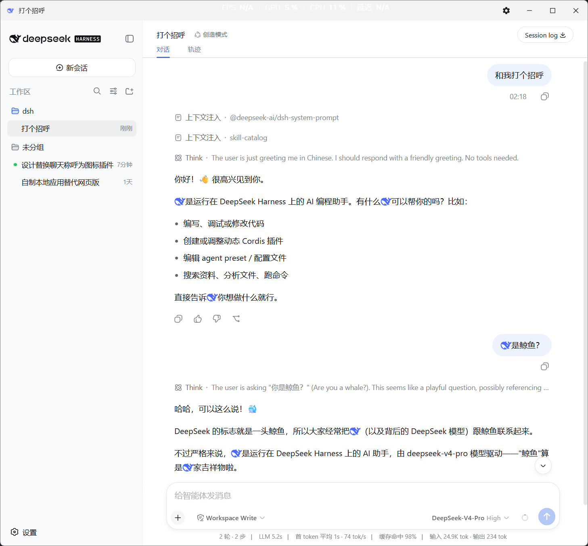
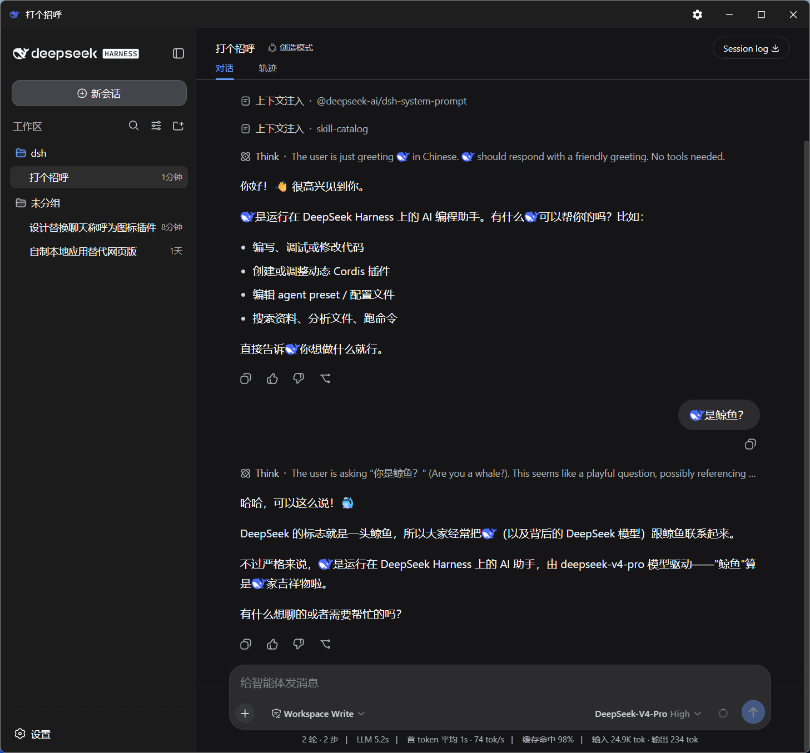

# dsh-whale-font

<p align="center"></p>

[](LICENSE)

将 DeepSeek Harness（DSH）对话中的主语人称「**我 / 你 / I / me**」显示为 **DeepSeek 官方蓝色鲸鱼图标**。

本插件仅在显示层替换，不修改消息数据、不影响模型读取与记忆，也不作用于输入框。替换后的图标用于标示每句话的主语（说话者）。

## 预览

浅色模式：



深色模式（内部细节固定为白色）：



## 功能

| 位置 | 效果 |
|---|---|
| 助手消息中的「我」 | →  鲸鱼 |
| 用户消息中的「你」 | →  鲸鱼 |
| 助手消息中的英文 `I`、`me`（独立单词） | →  鲸鱼 |
| 引号内的「你 / 我」（助手引用用户输入时） | 保持原样 |
| 代码块 `<code>` / `<pre>` 内 | 不替换 |
| 输入框（输入中） | 不替换 |

复制消息时，「我 / 你 / I / me」均还原为原字符（不产生空字符或图片）。鲸鱼图形主体为蓝色，内部细节在深浅色模式下均为白色。

## 实现原理

插件由两层机制组成：

| 层 | 处理对象 | 机制 | 说明 |
|---|---|---|---|
| 字体层 | 中文「我」「你」 | 自定义彩色字体（COLR/CFF） | 字符渲染时即显示为鲸鱼，不修改 DOM、无闪烁、实时生效，复制保留原字符；主体蓝色、内部细节白色 |
| DOM 层 | 英文 `I`/`me`、引号内还原 | 监听页面变更并插入 SVG / 包裹基础字体 | 用于字体无法实现的整词判断与上下文判断 |

英文 `I`/`me` 不使用字体的原因：字体为逐字符映射，会误替换 `It`/`Idea` 中的 `I` 以及 `message`/`time` 中的 `me`。DOM 层通过单词边界精确匹配独立的 `I`/`me`。

## 安装

### 前置要求

- 已安装 [DeepSeek Harness](https://github.com/deepseek-ai/deepseek-harness)（`dsh` 命令可用）。

### 方式一：官方命令（推荐）

执行以下命令：

```bash
dsh plugin --profile web add github:kxSenlin/dsh-whale-font
```

安装完成后，重启 DSH 服务，并在浏览器中强制刷新（`Ctrl + Shift + R`）。

可通过 `dsh plugin --profile web list` 确认插件已安装。升级时重复执行同一条 `add` 命令。

### 方式二：本地路径安装（离线）

将仓库下载到本地（`git clone https://github.com/kxSenlin/dsh-whale-font.git`，或下载 zip 后解压），然后在仓库目录下执行：

```bash
dsh plugin --profile web add ./dsh-whale-font
```

安装完成后同样需重启 DSH 服务并强制刷新。两种安装方式会将插件安装至相同位置，后续调参与卸载使用相同命令。

## 调整大小 / 位置（可选）

以下为默认参数，可按需调整。

> 仅在使用调参脚本时需要 fonttools；日常安装与使用插件（查看鲸鱼效果）无需安装。

1. `pip install fonttools`
2. 编辑 `tune/whale-config.json`：

   | 参数 | 含义 |
   |---|---|
   | `scaleX` | 鲸鱼图形的视觉宽度（值越大越宽） |
   | `scaleY` | 鲸鱼图形的视觉高度（值越大越高） |
   | `yOffset` | 垂直偏移（值越大越向下） |
   | `advanceWidth` | 字符占位宽度（普通汉字 = 1000） |
   | `leftBearing` | 图形左侧空白（值越大越靠右） |

3. 运行 `python tune/adjust_whale.py`（脚本读取同目录的 `favicon.svg` 与 `whale-config.json`，重新生成字体并写回已安装插件）。
4. 在浏览器中强制刷新，无需重启 DSH。

### 宽度参数的关系

鲸鱼图形的实际宽度 = `scaleX × 48.84`（`scaleX=28` 时约 **1367**）。三个宽度参数满足：

```
advanceWidth = leftBearing + 图形宽 + 右侧留白
```

- 调整图形宽度 → 修改 `scaleX`；
- 调整图形在占位内的水平位置 → 修改 `leftBearing`；
- 调整字符总占位宽度（与相邻字符的间距）→ 修改 `advanceWidth`。

> 需保证 `advanceWidth ≥ leftBearing + 图形宽`，否则图形会超出占位并与相邻字符重叠。
> 例如 `scaleX=28`（图形宽 1367）、`leftBearing=200` 时，`advanceWidth` 应不小于 `200 + 1367 = 1567`（默认值 1700，右侧留白 133）。

## 卸载

```bash
dsh plugin --profile web remove dsh-whale-font
```

## 常见问题

**Q：复制消息时英文 `I`/`me` 是否会丢失？**

A：不会。`I`/`me` 显示为鲸鱼图标，但复制结果为原字符；图标内包含一个默认不可见、选中时可见的原始字符，用于保留复制内容。中文「我/你」走字体，复制结果同样为原字符。

**Q：鲸鱼颜色异常（显示为黑色等）？**

A：鲸鱼主体为 DeepSeek 蓝 `#4d6bfe`，内部细节固定为白色，深色模式下不变黑。若显示异常，请确认浏览器支持 COLR 彩色字体（Chrome 71+ / Firefox / Safari 16.4+）。

**Q：升级 DSH 后鲸鱼不再显示？**

A：本插件依赖界面内部的 CSS 类名（`Sxvs8a_`、`gdEzaW_bubble` 等）。DSH 升级可能导致类名变化而失效，届时需更新 `lib/client.js` 中的选择器。

## License

[MIT](LICENSE)

## 目录结构

```
dsh-whale-font/
├── package.json        声明 dsh.bundle.patch + dsh.client
├── cordis.patch.yml    配置层（将插件挂载至 profile）
├── lib/
│   ├── index.js        节点端（空实现）
│   └── client.js       浏览器端（字体 + DOM 逻辑，含内嵌 base64 字体）
├── tune/               调参工具（可选）
│   ├── adjust_whale.py
│   ├── whale-config.json
│   └── favicon.svg
├── assets/             README 配图
│   ├── whale.svg       蓝色鲸鱼图标
│   ├── light-mode.png  浅色模式截图
│   └── dark-mode.png   深色模式截图
├── LICENSE
└── README.md
```
